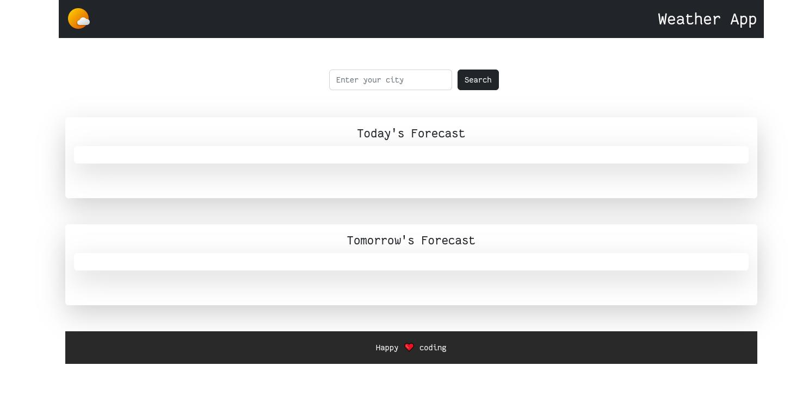

# Weather app

## Introduction
A web-based application which gives Today's and Tomorrow's weather forecast of a given city
> **Note**
> This Repo is a mirror please visit https://gitlab.com/dipankardas011/Weather-App
Link for azure Prod env -> https://weather-app-01.azurewebsites.net/ Link for azure Webapp created by Azure devops -> https://weather-app-az-pipe-sdc34f3cwe3.azurewebsites.net/  ## Learning Javascript
- CSS
- HTML
- API calls and how to manage them
- Azure container & app service
- Azure DevOps
- Kubernetes
- Docker

## Info
* Used gitlab for its CI/CD
* Used Kubernetes prod cluster in Okteto
* Used github for Azure DevOps pipeline

## hosted on
* stable release on the azure  [LINK](https://dipweatherwebapp.azurewebsites.net)
* Docker hub image name `dipugodocker/weatherapp:v3`
* K8s environment (okteto) [LINK](https://weather-app-dipankardas011.cloud.okteto.net/)

## branch info
* latest -> main
* azure & docker specific version -> v${number}

